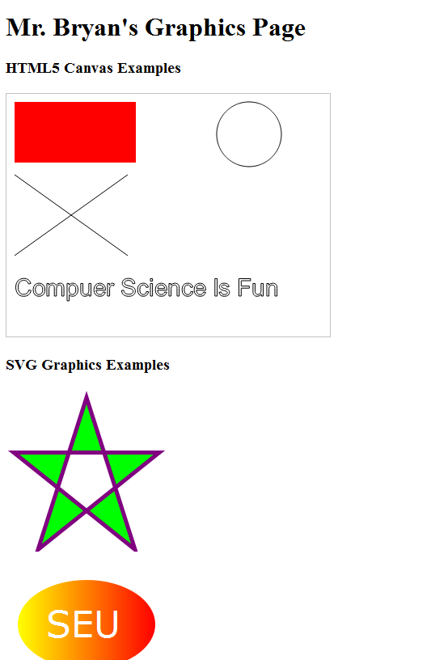

# COSC 2328
### Web Programming Assignment - In Class Graphics
**Due Date:** We will do this assignment together in class. If you don't finish in class, see Canvas for the due date

For this assignment you will use HTML5 and SVG graphics to create a web page with the images below. The images should appear on your web page exactly as they do below. Change the text "Mr. Bryan's Graphics Page" to your name's graphics page. You should use HTML5 Canvas graphics for the top half graphics, and SVG graphics for the bottom half. Here are links to documentation on HTML5 and SVG graphics: 
[W3Schools HTML5 Graphics](https://www.w3schools.com/html/html5_canvas.asp) 
[W3Schools SVG Graphics](https://www.w3schools.com/html/html5_svg.asp)

### To turn in your assignment
* Submit your files to Canvas as text files with a .txt extension.
* Add a link for this assignment "In Class Graphics Assignment" to your main index.html file. If this link is missing or if you do not have an index.html file you will receive a zero for the assignment. No exceptions.

